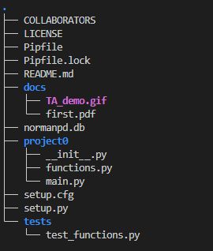

## Web scraping using python and its libraries  
#### steps to run project0   
##### Installation  
pyenv install 3.10.1  
pyenv global 3.10.1  
pip install --upgrade pip  
##### Running  
- cd cs5293sp23-project0/
- pipenv shell
- pipenv run python project0/main.py --incidents url
- pipenv run python -m pytest (to run test cases)

#### Packages   
- pytest
- pypdf
#### Folders  
- tests
- docs
- project0
#### Recording  

#### Project Structure

#### Assumptions and Expected bug resolving 
I considered the incident ori values present in all documents to be OK0140200, 14005, EMSSTAT, 14009 
since Most of the locations are in Capital letters and most of the nature values starts with capital letter and continues withsmall letters so, I used a regex accordingly to retrieve the fields.But some of the values in nature fields like MVA, COP DDACTS are capitals, so I replace them with Mva and Cop Ddacts to facilitate my regular expressions.

#### Issues Expected
If any more Capital letter keywords other than MVA,COP DDACTS that occurs in nature, then there might be situation where some words from nature can be found in location field.

#### Important files
functions.py--contains the implementation of functions
main.py--contains the calls for functions
..................
#### functions in functions.py
##### fetchIncidents(url)
fetchIncidents brings the data from url using the pdfreader from pypdf and 
returnd the data

##### extractIncidents(incident_data)
The starting page contain the text like "NORMAN POLICE DEPARTMENT\nDaily Incident Summary (Public)" and "Date / Time Incident Number Location Nature Incident ORI" and I replaced with the "" values.

We can't split the lines using \n character because in the "location" attribute the text can contain \n values, so if we split with \n values, a single line might split to the two lines, so we use the alternative method for splitting the lines as mentioned below.

For the values in Incident Ori,we have only three values (EMSSTAT\n, OK0140200\n and 14005\n, to split the lines of the pages, I am using # character,so I am replacing EMSSTAT\n, OK0140200\n and 14005\n with EMSSTAT#, OK0140200# and 14005# respectively so that we split the lines using the # character.

###### pattern matching:

After splitting the columns, I used some regular expressions pattern and to extract the Date/Time, Incident number, Location and nature.The following regular expressions are used :

Date/Time = \d{1,2}/\d{1,2}/\d{4}\s\d{1,2}:\d{2}
Incident number= \d{4}-\d{8}
Location=[A-Z0-9\s/.;-]*",
Ori=(OK0140200|14005|EMSSTAT)

After finding the match for Date/Time , I would extract the Date/Time and replace it with "" values, simliarly I would follow the steps for Incident_number and  location to facilitate the extraction of nature since replacing the values with "" leaves out only nature.   

I appended the data in the lists of list format and returned the lists of list values at the end of function.

##### createDB()
This function creates the database named normanpd and return the connection of the database.

##### populatedb(db, incidents)
This function takes the parameters as db and incidents, here db is connection and incident is lists of list.

This function checks if table named Incident_data exists, if exists Incident_data table is dropped and a new table is created with name Incident_data.The insert command is placed inside the for loop and runs over length of the lists of list.
##### status(db)
This function have parameter of connection string named db and returns the values (nature names according to their count) returned from the query and arranged the data seperated by the '|' symbol.

retrieval query:SELECT nature,count(nature) As count from Incident_data group by nature order by count desc, nature asc.

#### Testing:
I have used only one file to create the tests for 5 functions.

Folder : tests
filename : test_functions.py

The file test_functions.py have five functions and used the following url for testing the data

url="https://www.normanok.gov/sites/default/files/documents/2023-02/2023-02-01_daily_incident_summary.pdf"

##### test_fetch_data():
--test whether the url gives returns ant data from the function fetchIncidents

##### test_fetch_incidents():

--tests extractIncidents functionality

checks whether the function extractIncidents extracting the five values for each line in page.

##### test_create-db():

--tests the functionality of createDB

checks whether the database is created and connection is returned.
##### test_populate_db():

--tests functionality of populatedb()

The populatedb() aim is to populate the db with the extracted data, so in the test function test_populate_db , I am checking the count of records from the table Incident_data.
##### test_status():

--checks the functionality of status() in functions file

The test_status()  checks the count of nature Traffic Stop  from url mentioned in test_functions.py file.

